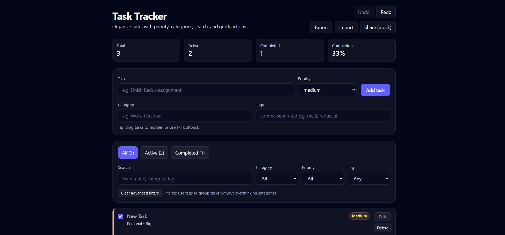

## Task Tracker App (React + Redux)

A task management application built using ReactJS and Redux Toolkit.

###Screenshot


### Features

- **CRUD**: create, edit, delete tasks
- **Status toggle**: mark tasks completed/active
- **Filtering**: All / Active / Completed + Category + Priority + Tag
- **Search**: search across title, category and tags
- **Categories & tags**: organize tasks with both
- **Priority levels**: low / medium / high with visual indicator
- **Reordering**: drag-and-drop (native HTML5) + keyboard ↑/↓ buttons
- **Undo/Redo**: task history for quick recovery
- **Import/Export**: JSON import/export (backup/restore)
- **Share (mock)**: copies tasks JSON to clipboard
- **Persistence**: saved to `localStorage`

### Tech Stack

- ReactJS
- Redux Toolkit
- React Hooks
- Tailwind CSS
- Redux async thunks + listener middleware (persistence)

### Setup

```bash
npm install
npm run dev
```

### Testing

```bash
# run tests in watch mode
npm test

# run once (CI)
npm run test:run

# run coverage report
npm run test:coverage
```

### Notes (for reviewers)

- **State management**: global task state lives in Redux (`src/features/tasks/taskSlice.js`), persistence is handled via a store listener middleware (`src/app/store.js`) rather than writing to storage inside reducers.
- **Accessibility**: all controls have labels; drag-and-drop has keyboard fallback.
- **Import format**: JSON file must be an array of task objects (extra fields are ignored, missing fields are normalized).

### Deployment (optional)

You can deploy quickly on Netlify:

- **Build command**: `npm run build`
- **Publish directory**: `dist`

### Optional improvement

Vite shows a warning on Node `20.17.0` (it recommends `20.19+` or `22.12+`). The app still runs, but upgrading Node is recommended for best compatibility.
